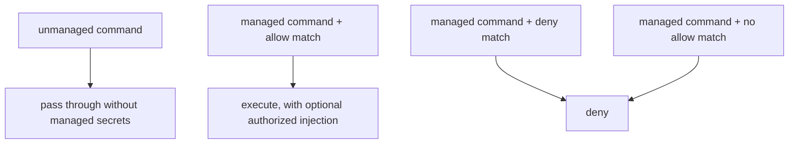

# Distinguish Managed Commands from Unmanaged Pass-Through Commands

- Status: Superseded by [20260806T192918Z_docker-context-secret-injection-runner.md](20260806T192918Z_docker-context-secret-injection-runner.md)
- Created: 2026-07-19T02:49:11Z

## Context

iwaya is a policy-aware command proxy. For v0.0.x, its explicit execution entrypoint is:

```sh
iwaya exec -- <command> [args...]
```

The existing command-proxy decision treated policy no-match as pass-through execution without managed secret injection. That model kept a planned managed shell usable for ordinary commands, but it did not distinguish two materially different cases:

- a command that iwaya does not manage
- an invocation of a managed command that no allow policy authorizes

Treating both cases as the same no-match fallback weakens the meaning of command management. A typo, an omitted rule, or an unexpected subcommand of a managed command could execute merely because it failed to match policy. The process might also use credentials obtained outside iwaya, so withholding an iwaya-managed secret does not make execution harmless.

At the same time, denying every command that is not configured would make a future session mode behave like a full-shell allowlist. That would require policies for ordinary commands unrelated to iwaya's credential boundary.

The policy semantics must also remain consistent between explicit execution and any future session frontend. The frontend may route commands differently, but the same command must not become authorized or denied solely because it entered iwaya through a different mode.

Related ADRs:

- [Define iwaya as a Policy-Aware Command Proxy](20260702T005400Z_policy-aware-command-proxy.md)
- [Use Explicit Command Execution for v0](20260718T211800Z_explicit-command-execution-for-v0.md)
- [Treat iwaya as a Mitigation Boundary, Not a Sandbox](20260710T170955Z_mitigation-boundary-not-sandbox.md)
- [Define iwaya as a Docker-Context Secret Injection Runner](20260806T192918Z_docker-context-secret-injection-runner.md) supersedes this decision.

This ADR supersedes the no-match fallback defined by the policy-aware command proxy ADR where that fallback applies to managed commands.

## Decision

iwaya must classify commands as either managed or unmanaged before evaluating command policy.

### Managed commands

A command is managed when it is registered as a managed command in the active iwaya configuration.

Registration establishes the management boundary for the command name. Every invocation of a managed command that enters iwaya must be evaluated by that command's policy.

A managed-command invocation has only two authorization outcomes:

- `Allow`
- `Deny`

An allowed invocation may additionally produce a secret injection mapping. An allow rule without an injection mapping authorizes execution without managed secrets.

Policy evaluation for a managed command must follow these rules:

1. A matching explicit deny rule takes precedence over matching allow rules.
2. A matching allow rule authorizes execution and may define the injection mapping.
3. If no allow rule matches, the invocation is denied.
4. Secret resolution must occur only after an allow result has been determined.
5. A denied invocation must not execute the target command.

Managed commands are therefore default-deny.

### Unmanaged commands

A command is unmanaged when it is not registered as a managed command in the active iwaya configuration.

An unmanaged command must pass through without managed policy evaluation, managed secret resolution, or managed secret injection.

For explicit execution, this means that the following invocation may execute as an unmanaged pass-through when `ls` is not registered:

```sh
iwaya exec -- ls -la
```

Unmanaged pass-through is not an allow-policy result. It means that iwaya has no management claim over that command and delegates it without managed credentials.

### Mode-independent semantics

The managed/unmanaged classification and managed-command policy semantics must not depend on the frontend that supplied the command invocation.

For v0.0.x, every command supplied through `iwaya exec --` is classified by iwaya:

- unmanaged commands pass through
- managed commands require an allow match and otherwise are denied

A future session frontend may route only registered managed commands into iwaya while allowing the shell to execute unmanaged commands directly. This is an implementation difference in routing, not a difference in authorization semantics.

Conceptually, both frontends must preserve the same behavior:



### Terminology

The project must use the following terms consistently:

- **managed command**: a command registered for iwaya policy management
- **unmanaged command**: a command not registered for iwaya policy management
- **policy no-match**: a managed-command invocation for which no allow or deny rule matches
- **unmanaged pass-through**: execution of an unmanaged command without managed policy or secrets

The term `no-match pass-through` must not be used for managed commands.

## Non-Goals

This decision does not:

- make iwaya a sandbox
- claim that an allowed command handles injected secrets safely
- require all shell commands to become managed
- define the complete configuration file syntax
- commit the project to implementing session mode
- prevent unmanaged commands from using credentials or state obtained outside iwaya

## Alternatives Considered

### Pass through every policy no-match

Under this model, managed and unmanaged commands would both execute without managed secrets when no policy matched.

This was rejected because an unexpected invocation of a managed command would still execute. Failing to receive an iwaya-managed secret is not equivalent to being unauthorized or harmless.

### Deny every unregistered command in explicit mode

Under this model, `iwaya exec --` would act as a complete command allowlist, while a future session would ordinarily let unregistered shell commands execute directly.

This was rejected because the same command would be denied or passed through depending on the frontend. It would also give explicit execution a broader sandbox-like meaning than iwaya can guarantee.

### Treat every command as managed and default-deny

Under this model, every command entering iwaya would require an allow policy.

This was rejected because a future interactive session would require explicit policies for ordinary commands unrelated to secret management. It would expand iwaya from a scoped command proxy into a general shell execution allowlist.

### Use mode-specific policy defaults

Under this model, explicit execution could default-deny while session mode defaulted to pass-through.

This was rejected because policy meaning would depend on the frontend. A future session must reuse the same core classification and authorization semantics rather than redefine them.

## Consequences

### Positive Consequences

- Registering a command clearly moves all of its invocations under iwaya policy management.
- Unexpected or misspelled invocations of managed commands fail closed.
- Ordinary unmanaged commands remain usable without requiring broad allowlists.
- Explicit execution and any future session frontend share the same authorization model.
- Unmanaged commands never receive iwaya-managed secrets.
- The distinction between lack of management and lack of authorization becomes explicit.

### Negative Consequences

- Adding a command to configuration changes all invocations of that command from pass-through behavior to default-deny policy management.
- Users must define allow rules for every managed-command invocation they intend to use through iwaya.
- Incomplete policies may deny legitimate command variants until configuration is updated.
- Documentation and diagnostics must explain whether a denial came from an explicit deny rule or the absence of an allow match.

### Neutral Consequences

- `iwaya exec --` may still be used with unmanaged commands, although those commands receive no managed-secret benefit.
- A future session frontend may avoid routing unmanaged commands through iwaya as an optimization.
- Explicit deny rules remain useful as exceptions to broader allow rules even though managed commands are default-deny.
- This decision changes policy fallback semantics but does not change iwaya's non-sandbox boundary.
