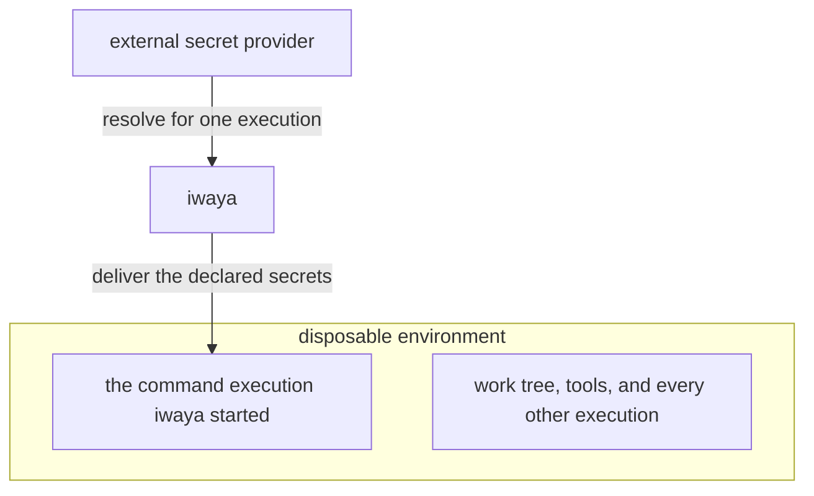

# Separate a Disposable Environment from a Non-Disposable Secret Boundary

- Status: Accepted
- Created: 2026-08-13T13:12:28Z

## Context

iwaya delivers a credential into a container and runs a configured command there. That command is an interactive development CLI, and increasingly one whose actions are decided while it runs rather than by the person who started it. A reader evaluating iwaya arrives at the obvious next question: what stops that command from doing something destructive in the container it now holds a credential in?

Two answers are available. One is to constrain what the command may do, by mediating its filesystem access, its network access, and the tools it invokes. The other is to accept that the command may do anything the environment permits, and to arrange that losing the environment costs little.

iwaya has already declined the first answer in pieces. [Treat iwaya as a Mitigation Boundary, Not a Sandbox](20260710T170955Z_mitigation-boundary-not-sandbox.md) prohibits describing iwaya as containment. [Define iwaya as a Docker-Context Secret Injection Runner](20260806T192918Z_docker-context-secret-injection-runner.md) removed the allow and deny rules, the argument-pattern evaluator, and repository-context authorization, because authorizing an arbitrary invocation requires knowing what the target program will do with the arguments it receives.

What has not been recorded is the other half: what iwaya assumes instead, and why the assumption is not simply an admission that nothing is protected.

The assumption is workable because the things reachable from a development environment are not equally replaceable. A work tree can be restored from version control, packages can be reinstalled, and a container can be rebuilt from its definition. A GitHub token, an API key, or a cloud credential cannot be reconstructed that way. It can be rotated, but rotation is a separate act with its own cost, and it does not undo what was done with the value while it was still valid. Such a credential carries authority over an external service, so the consequences of leaking or misusing it are felt outside the environment entirely, and they outlive the container it leaked from. Treating the environment and the credential as one problem is what makes the question unanswerable; separating them is what makes it tractable.

This decision needs an ADR because it fixes a project-scope non-goal, because it records an assumption about the user's environment that the design depends on and iwaya cannot check, and because it is the concept the rest of the documentation is organized around.

Related ADRs:

- [Treat iwaya as a Mitigation Boundary, Not a Sandbox](20260710T170955Z_mitigation-boundary-not-sandbox.md) remains accepted. It states what iwaya does not contain; this decision states the premise its non-goals leave implicit.
- [Define iwaya as a Docker-Context Secret Injection Runner](20260806T192918Z_docker-context-secret-injection-runner.md) defines the configuration and delivery model that implements the secret boundary described here.

## Decision

iwaya must divide safety into two boundaries with opposite purposes: a disposable boundary around the environment, which limits the blast radius while leaving broad authority inside it, and a secret boundary into that environment, which minimizes what is allowed to cross.

Stated as one sentence: give a command broad authority over a disposable environment, and control tightly which secrets are allowed to cross into it.

iwaya carries a secret into the environment only for the execution it was asked to run. Ordinary work in the same environment, such as running a build or a version-control command, is unaffected by iwaya and receives no iwaya-delivered credential. A credential placed in the environment by other means is outside this boundary, as [the security model](../design/security-model.md) records.

### The disposable boundary limits the blast radius

Inside the environment, a command must be able to act broadly. Editing files, adding dependencies, and running further commands are ordinary development work, and iwaya must not require them to be enumerated or approved in advance.

What makes that acceptable is recoverability rather than restriction. A damaged environment must be discarded and recreated rather than trusted and repaired, and iwaya must be documented in those terms.

Rebuilding must be sufficient to remove everything iwaya placed in the environment, with no iwaya-side cleanup step. This follows from the existing prohibition on persisting a raw secret in configuration, logs, caches, or command-specific login state, recorded in [the runner ADR](20260806T192918Z_docker-context-secret-injection-runner.md). What the command itself wrote is outside that claim.

### The secret boundary minimizes what crosses

A credential is authority that outlives the environment holding it, so the opposite rule applies to it. A secret must not be exported into the invoking environment, left permanently in the container, built into an image, or written into the work tree. It must exist inside the environment only for the execution that was declared to need it.

What the boundary reduces to is one question — which secrets does this execution receive? — and the answer must be fixed in configuration rather than chosen at the invocation. [The configuration model](../design/configuration.md) defines the layers that hold it: a provider states where a secret comes from, a context states which environment the execution is delegated to, and a command policy states which secrets that execution receives. Whether the user is entitled to a value remains the provider's decision, which [the security model](../design/security-model.md) separates from the delivery scope configuration fixes.

The boundary governs crossing, not what happens afterwards. A process that has received a secret can read it, and iwaya does not protect a secret from the execution it was delivered to; [the security model](../design/security-model.md) states that limit and the others alongside it.

### iwaya must not restrict behavior

iwaya must not gain a mechanism whose purpose is to constrain what a command does after it starts. This excludes at least:

- filesystem read or write policy
- network destination allowlists and application-layer request filtering
- interception, inspection, or approval of the commands the target invokes
- syscall, capability, or process restriction

iwaya has no position from which to enforce such a rule. It constructs a runtime invocation and hands control to the container runtime, and every operation afterwards happens in a process it does not mediate. Enforcement of that kind belongs to the container runtime, the operating system, or a purpose-built isolation layer, any of which may be used around iwaya.

### The premise is the user's to satisfy

An environment is disposable when it shares no more of the host than the work requires, holds no permanently installed host credential, has a work tree restorable from version control, and can be recreated from its definition. Every one of those is a property of how the user built the environment, not of iwaya.

iwaya must not test that property, must not refuse to run when it appears not to hold, and must not report on it. A test of that kind would be a heuristic presented as a guarantee, which is the failure mode [the mitigation-boundary record](20260710T170955Z_mitigation-boundary-not-sandbox.md) exists to prevent.

Documentation must state the premise where a user decides whether to rely on iwaya, so that a user whose environment is not disposable can recognize that they need a layer iwaya does not provide.

## Non-Goals

This decision does not:

- add, remove, or change any CLI, configuration, or execution behavior
- make iwaya responsible for creating, provisioning, maintaining, or destroying the disposable environment
- make iwaya responsible for the integrity of the environment it delivers into
- require a specific isolation technology, or preclude one
- weaken any existing constraint on where a raw secret may be written
- claim that a disposable environment makes running an untrusted command safe

## Alternatives Considered

### Restrict the command's behavior inside iwaya

Under this model, iwaya would carry policies describing which paths a command may read, which hosts it may reach, and which tools it may invoke, and would enforce them for the executions it starts.

This was not selected because iwaya is not in the path of the operations such a policy governs. Enforcing one requires intercepting operations as they occur, which is a property of the layer the process runs on rather than of the program that launched it. Building the vocabulary into iwaya without the enforcement would restate the mistake corrected by [the runner ADR](20260806T192918Z_docker-context-secret-injection-runner.md): a mechanism that reads as access control while providing only matching.

### Treat the environment and the credential as one problem

Under this model, iwaya would aim at a single notion of safety covering both what the command does and what it may reach, and would grow whichever controls that notion demanded.

This was not selected because the two halves have opposite economics. Broad authority inside the environment is what makes the tool useful and is cheap to grant, because the environment can be rebuilt. Broad authority over a credential is expensive to grant, because its effects are external and outlast the environment. A single boundary would have to be as strict as its stricter half, which would either make ordinary development work require approval or leave the credential governed as loosely as a scratch directory.

### Verify that the target environment is disposable

Under this model, iwaya would inspect the selected context — its mounts, volumes, and image provenance — and warn or refuse when the container looked durable.

This was not selected because disposability is not an inspectable attribute. A container with no volumes may still hold hours of unreproducible state, and one with a mounted work tree may be rebuilt in seconds. iwaya would be asserting a property it cannot observe, and a user whose invocation passed the check would reasonably read it as approval.

### Require an external isolation layer

Under this model, iwaya would run only when the target was known to be running under a layer that restricts the command.

This was not selected because it couples iwaya to a specific isolation technology and to a means of detecting it, and it denies use to the case this design is for: a development container that is already disposable. Whether further isolation is warranted depends on what the user chooses to run, and that judgment stays with the user.

## Consequences

### Positive Consequences

- The assumption the design rests on is written down, so a user can check it against their own environment before relying on iwaya.
- A proposed feature can be placed on one side of the split or the other, which decides whether it belongs in iwaya at all.
- iwaya composes with whatever isolation a user already has, instead of competing with the layers positioned to enforce it.
- Recovering a damaged environment is rebuilding it, and needs nothing from iwaya, because iwaya leaves no credential state behind.
- Ordinary development work in the environment stays out of iwaya's way, because only an execution that needs a credential is invoked through it.

### Negative Consequences

- A user whose environment is not disposable gets no help from iwaya in making it so, and must add a layer iwaya does not describe.
- iwaya does not build the disposable environment either, so a user must already have one before iwaya is useful.
- The premise is unverified, so a user who ignores it sees no warning and gets a working invocation.
- iwaya offers nothing against a command that damages the environment it runs in, although iwaya is the component that made that command more capable by delivering a credential to it.
- Stating the premise plainly can be read as endorsing the execution of untrusted commands, so documentation has to keep recoverable and safe distinct.

### Neutral Consequences

- Nothing in the CLI, the configuration model, or the execution model changes. This records the concept the current design already embodies.
- The split concerns the environment and the credential rather than the command, so iwaya treats a trusted and an untrusted command identically.
- An isolation layer and iwaya may be used together, and neither implies the other.
