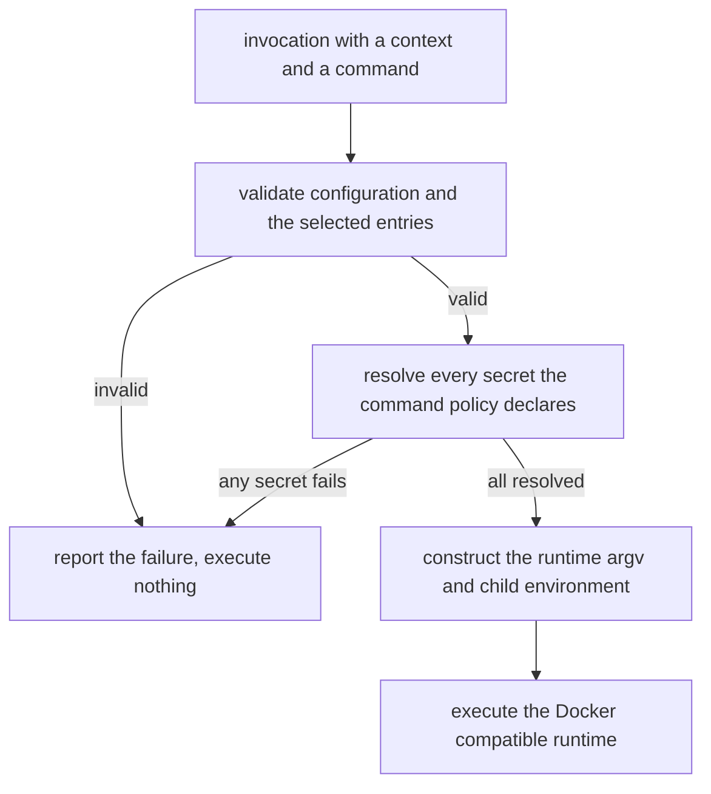

# Docker Execution Context and Command Policy Model

This document defines how iwaya turns an invocation into a command running inside a container with the secrets that command needs.

It is normative. Where it states a requirement, an implementation that violates it is incorrect.

The security boundary this model operates within is defined in [Security Model and Limitations](security-model.md), and the reasoning behind the model is recorded in [Define iwaya as a Docker-Context Secret Injection Runner](../adr/20260806T192918Z_docker-context-secret-injection-runner.md). Neither is restated here.

## Scope

This document owns the configuration model, the order of validation, secret resolution, and execution, the construction of the runtime invocation, and the invariants an implementation must preserve.

It does not define the CLI output contract. Output formats, exit-code categories, stable error codes, and diagnostic rendering are not decided here; see [Error Behavior](#error-behavior) for what this model does require of a failure.

The configuration syntax shown here is a baseline example rather than a syntax reference. Once a parser exists, the field-level contract belongs in a generated configuration reference derived from it.

## The Three Configuration Layers

Configuration is divided into three layers, each answering one question.

| Layer | Question | Defines |
|---|---|---|
| Secret provider | How is a secret obtained? | The provider type and its provider-specific settings |
| Docker execution context | Where does a command run? | The Docker-compatible runtime and the container to execute in |
| Command policy | Which secrets does a command receive? | The environment variable names and the secrets that supply them |

The layers are independent by construction. A provider must not select contexts or commands, a context must not declare secrets, and a command policy must not declare container settings. This is what allows one container and one command to be defined once each, rather than once per combination of the two.

### Secret Providers

A provider defines how a secret is obtained. It does not decide which command receives it.

```kdl
providers {
  bws "bws-default" {
    project "philomagi.dev"
  }
}
```

The node name is the provider type. The first argument is the provider identifier, which must be unique across all provider instances, including instances of different types. Settings a provider type requires belong inside that provider's block.

Each provider type declares what it requires. A general parameter model covering providers that do not exist yet must not be designed in advance.

The example above omits the `bws` provider's required `access-token` block to show the shape shared by every provider type; see [Provider Credentials](#provider-credentials) below for the settings `bws` itself requires.

#### Provider Credentials

A provider type may require a credential of its own before it can resolve any secret. A provider credential authenticates the provider's client to its backend. It is not among the values the provider resolves, and it is never delivered to a command policy.

A provider type that requires a credential declares how the credential is acquired inside its own configuration block. The acquisition method is represented by a child node name, following the same node-name-as-type convention used elsewhere in this model. A credential-acquisition abstraction covering acquisition types that do not exist yet must not be designed in advance.

Where a provider credential may exist at run time, and how that differs from a resolved user secret, is defined in [Provider Credentials](security-model.md#provider-credentials).

##### BWS Access Token

The `bws` provider requires an access token before it can resolve any secret. The token is declared with an `access-token` block:

```kdl
providers {
  bws "bws-default" {
    project "philomagi.dev"

    access-token {
      exec "pass" "show" "bws/access-token"
    }
  }
}
```

A `bws` provider requires exactly one `access-token` block, and `access-token` requires exactly one acquisition node. `exec` is the only acquisition type this model defines; an unsupported acquisition node name is a configuration error.

`exec` requires an executable as its first argument and accepts zero or more following argv entries. It invokes the executable directly, without a shell, so shell syntax, interpolation, redirection, and command separators in its arguments are not interpreted. An `exec` node without an executable argument is a configuration error.

The example above uses `pass` to show the shape of an acquisition command. `pass`, GPG, and a pre-existing `BWS_ACCESS_TOKEN` in the invoking environment are illustrations, not requirements: the `bws` provider does not assume a specific credential store, and it does not read an access token from the invoking environment.

On acquisition, a successful command's stdout supplies the access-token value. One trailing line ending (`\n` or `\r\n`) is removed from stdout before it is used; other stdout content is preserved. An empty value after that removal, a failure to start the command, and a non-zero exit status are each an access-token acquisition failure.

If access-token acquisition fails, BWS secret resolution is not attempted.

##### BWS Secret Resolution

The `bws` provider resolves a secret by invoking the `bws` CLI as a subprocess. The acquired access token is supplied to that subprocess as `BWS_ACCESS_TOKEN` in its environment, and only that way: it is never passed through `--access-token` or any other argv value, because a raw value in argv is visible to any process that can read the host process table.

`BWS_ACCESS_TOKEN` in the `bws` subprocess's environment always takes the acquired value, overwriting a same-named variable already present in the invoking environment. It is never inherited from, and never falls back to, that value.

### Docker Execution Contexts

A context defines the container a command runs in.

```kdl
contexts {
  docker "iwaya" {
    runtime "podman"
    user "vscode"
    workdir "/workspaces/iwaya"
    container-name "iwaya-dev"
  }
}
```

The node name `docker` denotes the Docker-compatible `exec` model. A context type is a node name in this block, so adding one is a configuration-model change rather than a new field.

| Field | Required | Meaning |
|---|---|---|
| first argument | yes | The context identifier, which must be unique |
| `runtime` | no | The Docker-compatible command to invoke. Defaults to `docker` |
| `user` | yes | The user the command runs as inside the container |
| `workdir` | yes | The working directory inside the container |
| `container-name` | yes | The name of the target container |

`user` and `workdir` are required because the constructed argv always carries `--user` and `--workdir`. No invocation shape omits either one, so a context missing them is a configuration error rather than a request to let the container decide.

`runtime` must be treated as a single executable. It must not be evaluated as a shell command string, so a value containing arguments, redirection, or command separators is a configuration error rather than a way to extend the invocation.

### Command Policies

A command policy defines which secrets a command receives, and under which environment variable names.

```kdl
policies {
  command "claude" {
    secret \
      "ANTHROPIC_AUTH_TOKEN" \
      provider="bws-default" \
      secret-name="ANTHROPIC_AUTH_TOKEN"
  }
}
```

| Element | Meaning |
|---|---|
| `command` first argument | The command identifier, which must be unique |
| `secret` first argument | The environment variable name the value is injected as |
| `provider` | The identifier of the provider that supplies the value |
| `secret-name` | The name of the secret within that provider |

The command identifier serves two roles at once: it is the name the user types at the invocation, and it is the command name executed inside the container.

The declared environment variable names, together with the provider and secret name supplying each, are the complete injection mapping. An invocation cannot name a provider, a secret name, or an environment mapping, so the delivery scope is fixed in configuration and reviewable there.

A command policy is not an allow or deny rule. Matching machinery of that kind — argument patterns, rule priority, fallback, repository matching — has no place in the model, because none of it would constrain what the target command can do with the credential it received.

### Baseline Example

```kdl
/- kdl-version 2

iwaya version=1 {
  providers {
    bws "bws-default" {
      project "philomagi.dev"

      access-token {
        exec "pass" "show" "bws/access-token"
      }
    }
  }

  contexts {
    docker "iwaya" {
      runtime "podman"
      user "vscode"
      workdir "/workspaces/iwaya"
      container-name "iwaya-dev"
    }

    docker "git-kura" {
      runtime "podman"
      user "vscode"
      workdir "/workspaces/git-kura"
      container-name "git-kura-dev"
    }
  }

  policies {
    command "claude" {
      secret \
        "ANTHROPIC_AUTH_TOKEN" \
        provider="bws-default" \
        secret-name="ANTHROPIC_AUTH_TOKEN"
    }

    command "gh" {
      secret \
        "GH_TOKEN" \
        provider="bws-default" \
        secret-name="GH_TOKEN"
    }
  }
}
```

The three layers sit under an `iwaya` root node carrying a configuration `version`, so the version is available before anything below it is interpreted.

## Selecting a Context and a Command

The entrypoint is:

```sh
iwaya exec --context <context> <command> -- [args...]
```

```sh
iwaya exec --context iwaya claude
iwaya exec --context git-kura claude -- --resume
```

`--context` is required. iwaya must not infer a context from the working directory, the repository, or a default entry, because that would let something other than the user decide which container receives a credential.

The command operand must name a configured command policy. Every configured context may be used with every configured command policy, and the pairing is chosen at the invocation rather than fixed in configuration. There is no per-context command restriction, because a restriction of that kind would read as an authorization rule that iwaya cannot enforce: the same container is reachable through the runtime directly.

Arguments for the target command are separated by `--`. Everything after `--` is appended unchanged to the end of the target command, and iwaya does not interpret it. iwaya does not analyze the target command's subcommands or option interactions, so the fixed part of an invocation does not constrain what the target command can be asked to do once it holds the credential.

An unknown context name and an unknown command name are both errors. There is no execution path for a command that no policy defines: iwaya does not classify commands, and it does not pass anything through unmanaged.

## Execution Order



The order is a requirement, not an optimization.

### Validation Precedes Secret Resolution

Validation must cover at least:

- the configuration root and its version
- the uniqueness of provider, context, and command identifiers
- the existence of the selected context and the selected command policy
- the required fields of every Docker context
- the uniqueness of environment variable names within each command policy
- the existence of every provider a command policy references
- the required fields of every provider credential declaration, including the acquisition node it names, such as the `bws` provider's [`access-token` block](#bws-access-token)

Apart from the existence of the selected entries, validation covers the whole configuration rather than only the entries this invocation uses. A defect in an unselected context or policy is reported when it is introduced, not on the first invocation that happens to reach it.

If validation fails, no secret is resolved and the runtime command does not run. Resolution is itself observable to the provider, so a request whose result cannot be used must not be made.

### Resolution Precedes Execution

After validation succeeds, iwaya resolves every secret the selected command policy declares, and only those.

If any one of them fails to resolve, the runtime command does not run. A partially populated environment is never handed to the container, because a command that starts with a missing credential either fails later in a less diagnosable way or proceeds against a credential it should not have used.

A provider that requires a credential of its own, such as the `bws` provider's access token, acquires that credential before it resolves any secret. Acquisition failure is a secret-resolution failure: nothing executes, and no secret is resolved from that provider. See [BWS Access Token](#bws-access-token) for the acquisition contract.

## Invocation Construction

For this invocation, against the baseline example above:

```sh
iwaya exec --context iwaya claude -- --resume
```

the constructed argv is:

```text
podman
exec
--interactive
--tty
--env
ANTHROPIC_AUTH_TOKEN
--user
vscode
--workdir
/workspaces/iwaya
iwaya-dev
claude
--resume
```

The construction rule is:

```text
runtime
+ exec
+ --interactive / --tty
+ --env <environment-name> for each secret in the command policy
+ --user <user>
+ --workdir <workdir>
+ <container-name>
+ <command>
+ user arguments
```

`--interactive` and `--tty` are always present.

An `--env` option must be generated only for an environment variable that the selected command policy declares. No other option may be generated from configuration, and no arbitrary runtime option is passed through, so the argv above is the complete shape of what iwaya builds.

## Environment Injection Constraints

The resolved values are set in the environment of the runtime process that iwaya starts on the host. The container receives them because each name is forwarded with `--env NAME`.

This section constrains the environment of that runtime process. A provider credential, such as the BWS access token, follows a separate path into the environment of a different subprocess; see [BWS Secret Resolution](#bws-secret-resolution) and [Provider Credentials](security-model.md#provider-credentials).

- The `--env NAME=VALUE` form must never be used. A raw secret value must not appear anywhere in the runtime argv, where it would be visible to any process that can read the host process table, and where argv-recording tools would capture it.
- A policy-managed environment variable must always take the resolved value, overwriting a same-named variable in the invoking environment. It must never inherit the parent's value.
- When resolution fails there is no fallback to the same-named variable in the invoking environment, and the command does not run.

Where the secret can travel after that is a property of the operating system and the container runtime rather than something this model constrains; [the security model](security-model.md) owns that boundary.

## Error Behavior

Every failure in this model shares one property: no container is ever given a partial or substituted set of credentials.

Failures occur at three stages, and each stage constrains what must not happen afterwards.

- **Validation.** No secret is resolved, and nothing is executed.
- **Secret resolution.** Nothing is executed, no already-resolved value is delivered anywhere, and no policy-managed variable falls back to the invoking environment.
- **Execution.** The runtime may fail to start, or exit before the target command runs, for reasons this model does not control: a `runtime` binary that is missing, a container that is not running, a `user` or `workdir` the container rejects. iwaya reports the failure. It must not retry with a different credential set, re-resolve, or fall back to the invoking environment.

A diagnostic must identify what failed precisely enough to act on. Naming the provider identifier, the secret name, the environment variable name, the context, the command, or the configuration location is required where it is available, and a diagnostic must never carry a raw secret value or a provider credential, including the access-token acquisition command's stdout. Where raw values and provider credentials must not be written more generally is defined by [the security model](security-model.md#secret-lifecycle).

Failure causes must be distinguishable from one another. A configuration that does not parse, an unknown context, an unknown command, a provider that rejected a request, and a container that is not running call for different corrective actions, and a diagnostic that does not separate them leaves the user guessing.

## Process Behavior

When the runtime command runs, iwaya passes stdin, stdout, and stderr through to it, exits with its exit status, and forwards signals to it as far as the platform and the container runtime allow.

Apart from secret injection and the forced `--interactive` and `--tty` behavior, a caller should observe no difference from invoking the runtime directly.

## Architectural Invariants

1. Providers, contexts, and command policies are independent; none of them names an entity in another layer except by identifier reference.
2. The context and the command are both supplied by the invocation, and neither is inferred.
3. Every configured context is usable with every configured command policy.
4. Only a configured command policy can be executed; there is no unmanaged pass-through and no command classification.
5. An invocation cannot introduce a provider, a secret, or an environment mapping.
6. Validation completes before any secret is resolved.
7. Every declared secret resolves before the runtime command is executed, and only declared secrets are resolved.
8. Raw secret values never enter the runtime argv, and exist only in the environment of the runtime process and inside the container. Where else they must not be written is defined by [the security model](security-model.md#secret-lifecycle).
9. An `--env` option exists only for an environment variable declared by the selected command policy.
10. A policy-managed environment variable is never satisfied by the invoking environment, whether by inheritance or by fallback.
11. iwaya is not represented as a sandbox.
12. A provider credential never enters any subprocess argv, and exists only in the environment of the provider subprocess that requires it. It is never propagated to the container runtime process or the target container command.

## Related Documents

- [Security Model and Limitations](security-model.md) defines what this model does and does not protect against.
- [Architecture Decision Records](../adr/README.md) record why these choices were made.
