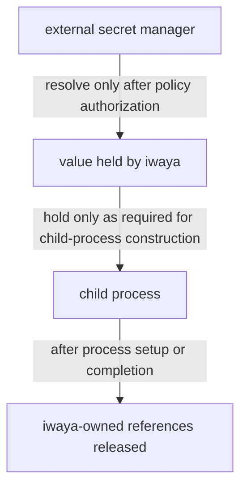

# Security Model and Limitations

This document defines the security boundary iwaya claims, the exposure it is designed to reduce, and the protection it explicitly does not provide.

Read this before relying on iwaya to protect a credential, and before describing iwaya's guarantees in documentation, diagnostics, or issue discussion.

The durable decision behind this boundary is recorded in [Treat iwaya as a Mitigation Boundary, Not a Sandbox](../adr/20260710T170955Z_mitigation-boundary-not-sandbox.md).

## Mitigation Boundary, Not a Sandbox

iwaya is a mitigation layer. It is not a sandbox, and it does not contain hostile code.

The distinction matters because the two provide different guarantees. A sandbox constrains what a running process is able to do. iwaya instead constrains which processes receive a secret, and how long that secret remains in scope. Once a process holds a secret, iwaya has no further control over it.

iwaya must never be described as a sandbox, an isolation layer, or a containment mechanism.

## What iwaya Reduces

iwaya is designed to reduce the following forms of credential exposure:

- persistent raw secrets stored in repositories, shells, containers, or command-specific login state
- session-wide secret exposure, in which every process inherits a credential from the environment
- unnecessary secret delivery to commands that do not require the credential
- manual credential selection errors, such as using a broadly scoped token where a narrow one would suffice

Each of these is an exposure reduced by construction rather than a property enforced against an adversary.

## What iwaya Does Not Protect Against

iwaya provides no protection against the following.

**A command that misuses a secret it was authorized to receive.** After injection, the child process may print, log, persist, or transmit the value. Policy authorizes delivery; it does not constrain use.

**Subprocesses of an authorized command.** A secret injected into a child process is inherited by that process's own children according to ordinary operating-system rules. iwaya does not intercept those subprocesses or re-evaluate policy for them.

**Commands invoked outside iwaya.** Only an invocation passed through iwaya enters iwaya's boundary. A command run directly from the shell, or directly through the container runtime, is resolved and executed without iwaya, and iwaya makes no claim over it. The entrypoint that exists today is recorded in [v0 Scope](../v0-scope.md#execution).

**Credentials obtained by other means.** An unmanaged command, or a managed command executing under an allow rule, may hold credentials from environment variables, configuration files, keychains, or prior logins. Withholding an iwaya-managed secret does not make such a process unprivileged.

**A compromised host, user account, or secret manager.** iwaya runs with the privileges of the invoking user and inherits the trust placed in the configured secret manager.

**Exfiltration in general.** iwaya narrows the window and the set of recipients. It does not close the channel.

## Secret Lifecycle

The intended lifecycle constrains how long a resolved value exists and where it may travel:

Resolution must not precede authorization. A denied invocation must not cause a secret to be fetched, because retrieval itself may be observable to the secret manager or to an intermediary.

Raw secret values must not be written to:

- repository files
- iwaya configuration
- logs or diagnostics
- persistent caches
- shell history
- any environment outside the authorized child process
- command-specific persistent login state created by iwaya

iwaya must not expose an API, subcommand, or output mode that prints, exports, or otherwise returns a raw secret value. Such a surface would turn iwaya from a delivery boundary into a general-purpose credential reader.

## Division of Responsibility

iwaya decides whether an invocation is authorized, and delivers only the authorized secrets to only that invocation.

The configured external secret manager remains responsible for storage, encryption, authentication, rotation, manager-side authorization, and manager-side audit behavior. iwaya is a client of that system, not a replacement for it.

An execution backend may happen to provide isolation, such as a container boundary. That isolation belongs to the backend and is not a guarantee of iwaya core. Backends must preserve the child-process-only injection boundary, but they are not required to strengthen it.

## Complementary Layers

Because iwaya cannot constrain an authorized process, meaningful protection requires additional layers:

- narrowly scoped credentials, so that an exposed secret grants little
- secret-manager authorization and audit, so that misuse is attributable
- operating-system permissions and user separation
- container or virtual-machine isolation for untrusted code
- sandboxing, when execution of untrusted code is genuinely required
- code review of the commands and scripts being run

iwaya is intended to compose with these layers rather than substitute for any of them.

## Non-Goals

iwaya does not aim to:

- contain malicious commands or scripts
- prevent every form of secret exfiltration
- act as a secret manager
- act as a general shell execution allowlist
- guarantee that an allowed command handles an injected secret safely

## Related Documents

- [Docker Execution Context and Command Policy Model](docker-execution.md) describes the configuration, the execution order, and the invariants that implement this boundary.
- [Architecture Decision Records](../adr/README.md) record why these boundaries were chosen.
