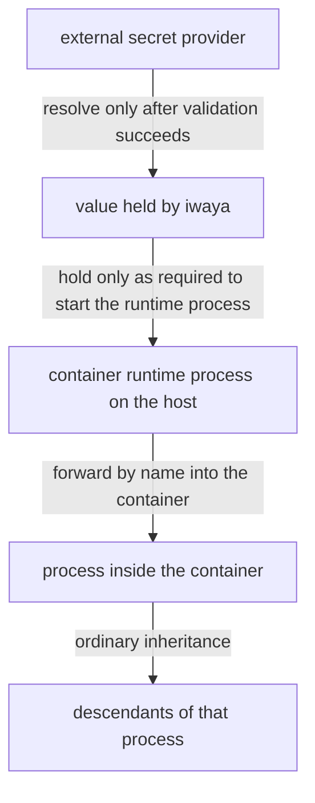
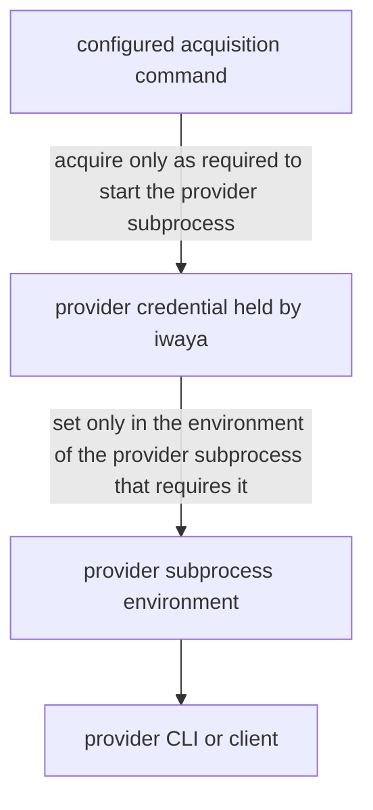

# Security Model and Limitations

This document defines the security boundary iwaya claims, the premise about the execution environment it assumes, the exposure it is designed to reduce, and the protection it explicitly does not provide.

Read this before relying on iwaya to protect a credential, and before describing iwaya's guarantees in documentation, diagnostics, or issue discussion.

The durable decisions behind this boundary are recorded in [Treat iwaya as a Mitigation Boundary, Not a Sandbox](../adr/20260710T170955Z_mitigation-boundary-not-sandbox.md), [Separate a Disposable Environment from a Non-Disposable Secret Boundary](../adr/20260813T131228Z_disposable-environment-and-secret-boundary.md), and [Define iwaya as a Docker-Context Secret Injection Runner](../adr/20260806T192918Z_docker-context-secret-injection-runner.md).

## Mitigation Boundary, Not a Sandbox

iwaya is a mitigation layer. It is not a sandbox, and it does not contain hostile code.

The distinction matters because the two provide different guarantees. A sandbox constrains what a running process is able to do. iwaya instead constrains which executions receive a secret at all. Once a process holds a secret, iwaya has no further control over it, including how long it keeps it.

iwaya must never be described as a sandbox, an isolation layer, or a containment mechanism.

## The Premise: a Disposable Environment

iwaya assumes the environment it delivers into is one the user can afford to lose. That assumption is what makes the boundary above a deliberate trade rather than a gap.

A work tree is restorable from version control, packages can be reinstalled, and a container can be rebuilt from its definition. A credential cannot be reconstructed that way, and its misuse is felt outside the environment and after that environment is gone. iwaya therefore leaves the environment alone and controls only what crosses into it.

Two things follow.

**iwaya does not restrict what a command does.** Editing files, adding dependencies, and running further commands are ordinary work inside the environment, and iwaya neither enumerates nor approves them. iwaya must not gain filesystem policy, network allowlists, command interception, or process restriction, because it starts a runtime process and does not mediate what happens inside it. A rule of that kind belongs to the container runtime, the operating system, or an isolation layer around iwaya.

**Satisfying the premise is the user's responsibility.** An environment is disposable when it shares no more of the host than the work requires, keeps no credential stored in it between executions, has a work tree restorable from version control, and can be recreated from its definition. iwaya must not test any of those properties, and must not refuse to run when the premise does not hold. Where the environment is not disposable, the user needs a layer iwaya does not provide.

Only an execution that needs a credential goes through iwaya. Ordinary work in the same environment is unaffected by it, and holds no iwaya-delivered credential.

## What iwaya Reduces

iwaya is designed to reduce the following forms of credential exposure:

- persistent raw secrets stored in repositories, shells, containers, or command-specific login state
- session-wide secret exposure, in which every process inherits a credential from the environment
- unnecessary secret delivery to commands that do not require the credential
- manual credential selection errors, such as using a broadly scoped token where a narrow one would suffice

## What iwaya Does Not Protect Against

iwaya provides no protection against the following.

**A command that misuses a secret it was configured to receive.** After injection, the process may print, log, persist, or transmit the value. A command policy fixes delivery; it does not constrain use.

**Every process that inherits the secret.** A resolved value passes through the environment of the container runtime process iwaya starts on the host, reaches the process inside the container, and is inherited by that process's descendants under ordinary operating-system and container-runtime rules. iwaya intercepts none of them.

**Credentials obtained by other means.** The command iwaya runs may already hold credentials from environment variables, configuration files, keychains, or prior logins inside the container. Withholding a policy-managed secret does not make such a process unprivileged.

**A compromised host, user account, container, or secret provider.** iwaya runs with the privileges of the invoking user and inherits the trust placed in the configured provider and in the container it executes in.

**Exfiltration in general.** iwaya narrows the window and the set of recipients. It does not close the channel.

## Secret Lifecycle

This lifecycle describes how long iwaya holds a resolved user secret and where it deliberately places it. It is distinct from a provider credential, such as a BWS access token, which has a separate, shorter lifecycle described in [Provider Credentials](#provider-credentials) below. Only the steps up to the container command are iwaya's to constrain; the inheritance past it is shown because a reader needs to know where the value ends up:

Resolution never precedes validation, as required by [the execution order](docker-execution.md#validation-precedes-secret-resolution). The security reason for that order is that retrieval is observable to the provider and to any intermediary, so an invocation that will not run must leave no trace of having asked.

Raw secret values must not be written to:

- repository files
- iwaya configuration
- logs or diagnostics
- persistent caches
- shell history
- the command line of any process, including the container runtime command iwaya builds
- any process environment other than the container runtime process iwaya starts and the container execution it forwards the names into
- command-specific persistent login state created by iwaya

The invoking shell is one of the environments a raw value must never reach. iwaya delivers a secret to the execution it was asked to run, and never back to its caller.

iwaya must not expose an API, subcommand, or output mode that prints, exports, or otherwise returns a raw secret value. Such a surface would turn iwaya from a delivery boundary into a general-purpose credential reader.

### Provider Credentials

A provider credential is a credential a provider needs to authenticate itself to its own backend, such as the BWS access token described in [the BWS Access Token declaration](configuration.md#bws-access-token). It is distinct from a user secret: a user secret is a value a provider resolves and iwaya forwards toward the target container, while a provider credential is never forwarded past the provider that requires it.

A provider credential exists only in the environment of the provider subprocess that requires it. It must never reach the environment of the container runtime process, the target container, or any other process, and it does not appear anywhere on the resolved-user-secret path shown in [Secret Lifecycle](#secret-lifecycle).

The same destinations [listed above](#secret-lifecycle) that a raw secret value must never be written to apply equally to a provider credential, with one difference: a provider credential's only permitted process environment is the provider subprocess that requires it, not the container runtime process. An access-token acquisition command's stdout carries the credential before iwaya holds it, and is subject to the same restrictions as the credential itself.

## Division of Responsibility

Configuration fixes what may be delivered and where. A command policy names the secrets a command receives, and a context names the container it runs in. Together they establish a configured delivery scope, which is not a decision about whether the invoking user is entitled to the credential.

That entitlement remains with the configured external secret provider, which is also responsible for storage, encryption, authentication, rotation, provider-side authorization, and provider-side audit behavior. iwaya is a client of that system, not a replacement for it. Both the configuration and the provider must permit a delivery for it to happen.

The container boundary belongs to the container runtime. iwaya runs commands inside a container, but that isolation is the runtime's property and is not a guarantee iwaya makes.

## Related Documents

- [Configuration Model](configuration.md) defines the providers, contexts, and command policies, including the provider-credential declarations this document constrains.
- [Docker Execution Context and Command Policy Model](docker-execution.md) describes the execution order and the invariants that implement this boundary.
- [Architecture Decision Records](../adr/README.md) record why these boundaries were chosen.
